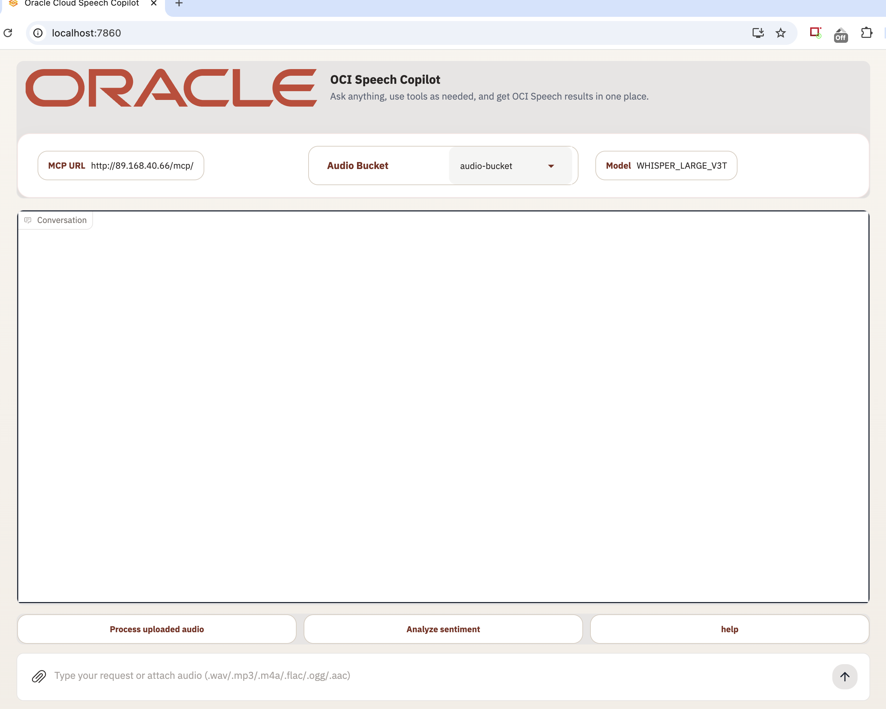
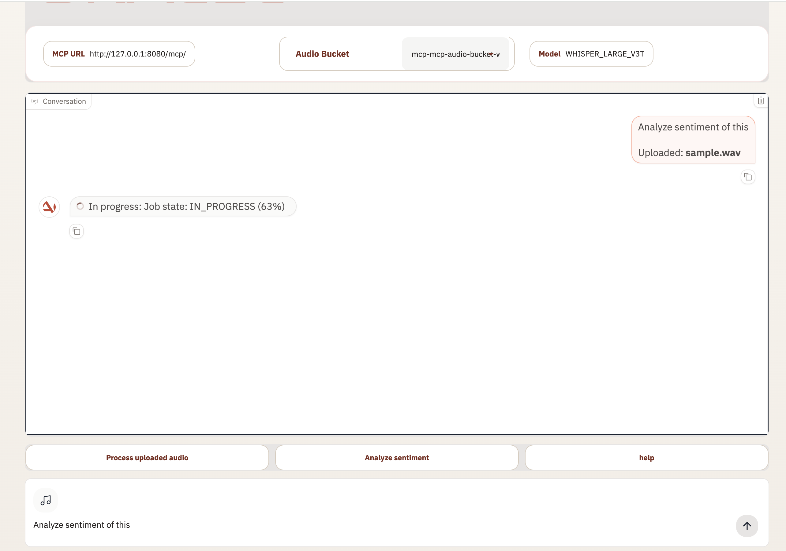
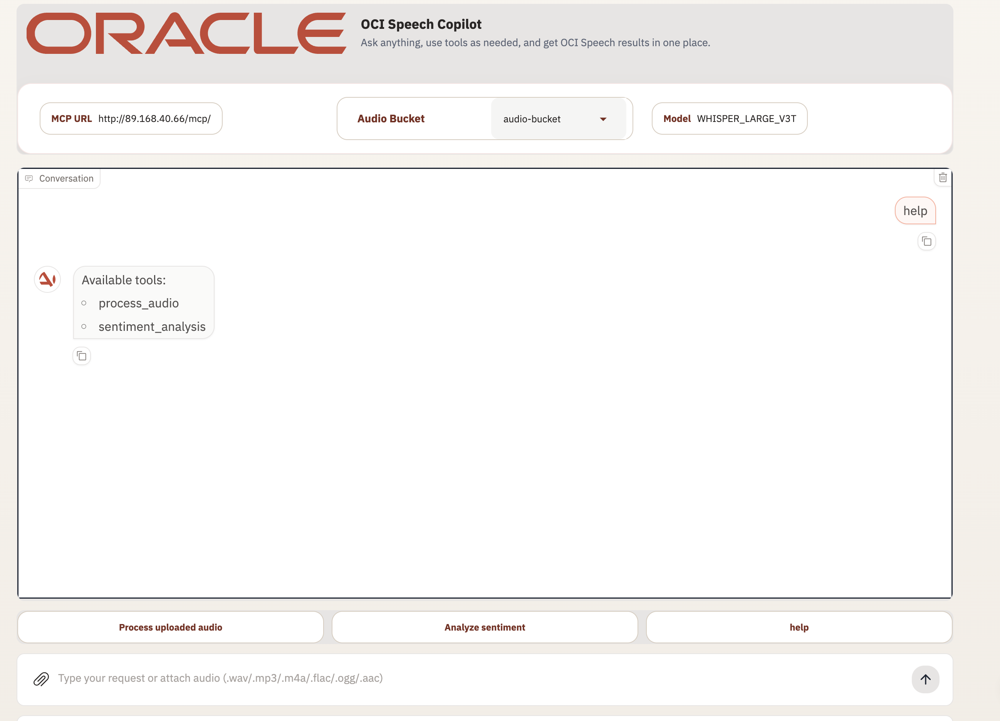
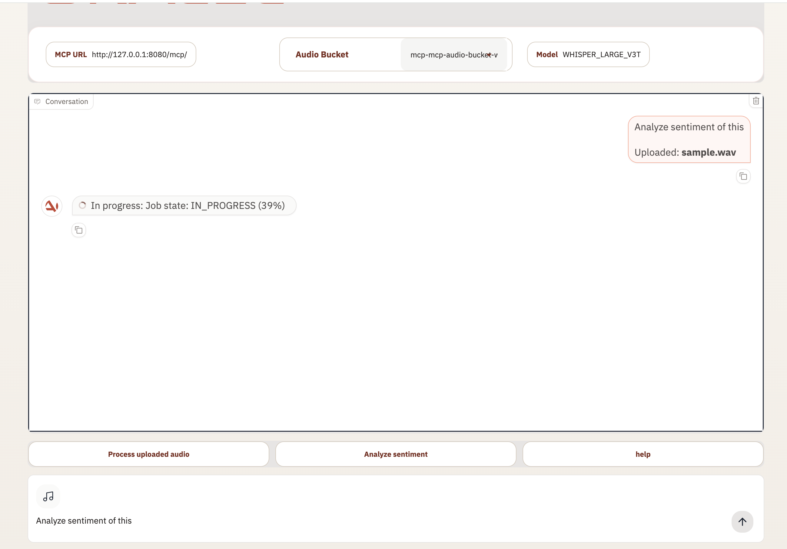
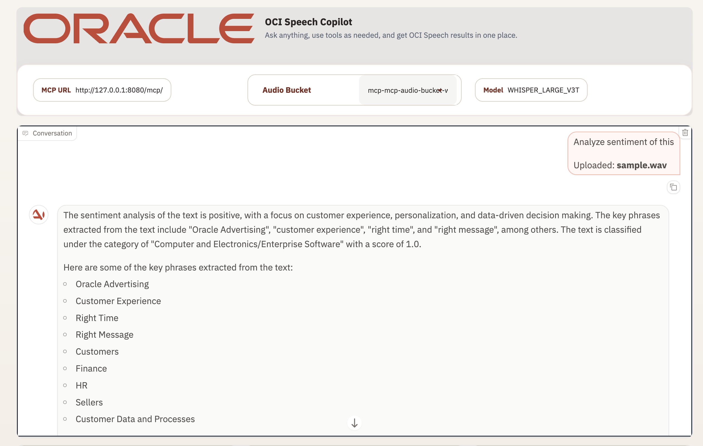

# MCP Audio + Client on OCI OKE

This repository deploys the MCP audio server and MCP client on OCI Kubernetes Engine (OKE), pushes both container images to OCIR, and wires the client to the server MCP endpoint.

## What’s included

- `terraform/` – OCI infrastructure for networking, OKE, OCIR repositories, bucket, and related resources
- `mcp-audio/` – MCP audio server source, Dockerfile, env template, and Kubernetes manifest
- `mcp-client/` – Gradio-based MCP client app
- `Makefile` – guided deployment, redeploy, validation, and cleanup helpers
- `blog/oci-oke-mcp-audio-deployment-guide.md` – full manual deployment runbook

---

## Easy deployment options

You have **2 ways** to deploy.

### Option 1: Easy mode with Makefile (best for beginners)

If you want the simplest path, use this option.

#### Step 1: Create your Terraform values file

```bash
cp terraform/terraform.tfvars.example terraform/terraform.tfvars
```

#### Step 2: Open `terraform/terraform.tfvars` and replace these values

```hcl
tenancy_ocid       = "<TENANCY_OCID>"
compartment_id     = "<COMPARTMENT_OCID>"
region             = "<OCI_REGION>"
resource_name_prefix                 = "mcp"
mcp_container_repository_name        = "audio-repo"
mcp_client_container_repository_name = "client-repo"
speech_bucket_name                   = "audio-bucket"
```

Terraform now builds OCIR repository and speech bucket names from three parts: `resource_name_prefix`, a base name, and the last 5 characters of your compartment OCID. For example, the default server repo becomes `mcp-audio-repo-hronz`.

Those naming values are already present in `terraform.tfvars.example`, so when you copy it they come along automatically. If you want custom base names instead of the defaults, edit them in `terraform.tfvars`:

```hcl
resource_name_prefix                 = "mcp"
mcp_container_repository_name        = "team-audio-repo"
mcp_client_container_repository_name = "team-client-repo"
speech_bucket_name                   = "team-audio-bucket"
```

If you keep the defaults, Terraform uses `audio-repo`, `client-repo`, and `audio-bucket` as the base names, and still outputs the final names for the rest of the deployment flow to use.

#### Step 3: Create your env files

```bash
cp mcp-audio/.env.example mcp-audio/.env
cp mcp-client/.env.example mcp-client/.env
```

#### Step 4: Run the guided deployment

Before you run it, set variables in 2 parts at the top of `Makefile`:

### Required (mandatory)

```make
TENANCY_OCID         ?= <your-tenancy-ocid>
COMPARTMENT_OCID     ?= <your-compartment-ocid>
REGION               ?= us-chicago-1
```

### Optional (can be left as default / prompted at runtime where applicable)

```make
DOCKER_USER          ?= <your-namespace>/<your-oci-username>
DOCKER_EMAIL         ?= <your-email>
DOCKER_PASS          ?= <your-ocir-auth-token>
IMAGE_VERSION        ?= latest
CLIENT_IMAGE_VERSION ?= latest
RESOURCE_NAME_PREFIX ?= mcp
MCP_CONTAINER_REPOSITORY_NAME        ?=
MCP_CLIENT_CONTAINER_REPOSITORY_NAME ?=
SPEECH_BUCKET_NAME                   ?=
```

Main values to replace there:

- `TENANCY_OCID`
- `COMPARTMENT_OCID`
- `REGION`

Optional (name overrides):
- `RESOURCE_NAME_PREFIX`
- `MCP_CONTAINER_REPOSITORY_NAME`
- `MCP_CLIENT_CONTAINER_REPOSITORY_NAME`
- `SPEECH_BUCKET_NAME`

The Makefile deployment flow uses the fixed Kubernetes namespace `mcp`.

These override values are treated as base names. The final resource names still include `RESOURCE_NAME_PREFIX` and the compartment-based suffix.

Helpful mapping:

- `DOCKER_USER` → usually `OCI_NAMESPACE/<oci-username>`
- `DOCKER_PASS` → your OCIR auth token
- `REGION` → usually `us-chicago-1`
- `TENANCY_OCID` / `COMPARTMENT_OCID` → from OCI Console
- `IMAGE_VERSION` / `CLIENT_IMAGE_VERSION` → usually `latest`
- `RESOURCE_NAME_PREFIX` → base prefix for generated repo and bucket names


During this step, the flow asks only when values are missing. Specifically:

- If `compartment_id` is already present in `terraform/terraform.tfvars`, it is reused (no prompt)
- If `region` is already present in `terraform/terraform.tfvars` (or `REGION` in Makefile), it is reused (no prompt)
- You may still be prompted for OCIR username/auth token and image tag when those are not preset

When Terraform has already been applied, the deploy helpers resolve the active OCI region from `terraform output -raw oci_region` first and only fall back to `terraform/terraform.tfvars` if outputs are not available yet.

So prompts may include:

- `COMPARTMENT_OCID`
- region
- OCIR username
- OCIR auth token
- image tag

Here is what each value means and where to get it:

| Value | What it is | Where to get it | Sample |
|---|---|---|---|
| `COMPARTMENT_OCID` | OCI compartment where you deploy | OCI Console → Identity & Security → Compartments | `ocid1.compartment.oc1..aaaa...` |
| `region` | OCI region | Same region you use in `terraform.tfvars` | `us-chicago-1` |
| `OCIR username` | Username used for OCIR login | Usually `<oci-username>` | `<namespace>/user@oracle.com` |
| `OCIR auth token` | OCI auth token for Docker login | OCI Console → User Settings → Auth Tokens | `<paste-token-here>` |
| `image tag` | Docker tag for server/client images | Your choice | `latest` |

Simple sample values based on this repo flow:

```text
COMPARTMENT_OCID = ocid1.compartment.oc1..aaaa...
region           = <your-deployment-region>
OCI_NAMESPACE    = output of `oci os ns get`
OCIR username    = ?/<oci-username>
image tag        = latest
```

How to quickly get/fill some of them:

```bash
# get OCI namespace
oci os ns get

```

#### Step 5: Validate everything

First validate:

```bash
make validate-fresh
```

If validation is successful, then sync `terraform.tfvars` from top-of-Makefile values:

```bash
make update-tfvars
```

`terraform init` in the Makefile includes retry handling for transient provider registry/network failures.

`terraform apply` now creates the bucket directly as part of Terraform, using the same deterministic naming logic as the OCIR repositories.

This ensures Terraform does **not** use placeholder values like `<COMPARTMENT_OCID>`.

Now run:

```bash
make deploy-fresh-guided
```


#### Step 6: Check the app is running

```bash
kubectl -n mcp get deploy,pods,svc -o wide
```

```bash
kubectl -n mcp get pods,svc
```

#### Step 7: Cleanup / destroy when needed

For full cleanup (Kubernetes + Terraform + bucket cleanup):

```bash
make destroy-all-fresh
```

Only remove Kubernetes app resources:

```bash
make destroy-k8s
```

### Important: compartment isolation

- Terraform only manages resources tracked in **that folder's Terraform state**.
- If you change `compartment_id` to a new compartment and run apply, Terraform operates against that configuration/state.
- It will **not automatically destroy resources in another compartment** unless those resources are in the same state and Terraform plans a replacement.

Safe practice before switching compartments:

```bash
terraform -chdir=terraform plan -var-file=terraform.tfvars
```

Review plan output before apply/destroy.


### Option 2: Manual mode using the blog guide

If you want to do each step yourself, use:

`blog/oci-oke-mcp-audio-deployment-guide.md`

That guide walks you through Terraform, image push, secrets, placeholder replacement, deployment, and checks.

`make quick-redeploy` also resolves the OCI region dynamically from Terraform output, prints the resolved value, and falls back to `terraform/terraform.tfvars` if needed.

## Quick things to remember


### 1. If you do manual deploy, check placeholders

Before applying `mcp-audio/k8s/manifest.yaml`, make sure placeholders are replaced.

Quick check:

```bash
grep -nE '<mcp-audio-image-tag>|<mcp-server-image-tag>|<mcp-client-image-tag>|<Compartment_OCID>|<OCI_NAMESPACE>|<SPEECH_BUCKET>' mcp-audio/k8s/manifest.yaml
```

If any placeholder still appears, replace values before deployment.


### 2. If image pull fails, recreate `ocirsecret`

This is one of the most common fixes.

---

## Local development

```bash
cp mcp-audio/.env.example mcp-audio/.env
cp mcp-client/.env.example mcp-client/.env

make dev-server-setup
make dev-client-setup

make dev-server-run
# new terminal
make dev-client-run
```

### Client UI notes

When the local client starts, the top bar shows:

- `MCP URL`: the MCP server endpoint the client is connected to
- `Audio Bucket`: the currently selected Object Storage bucket used for uploads and speech jobs
- `Model`: the default speech model exposed by the MCP server config

Home screen example:



The `Audio Bucket` dropdown is populated from OCI Object Storage using the active client configuration.

For local runs, the client typically needs:

- `ENVIRONMENT=dev`
- `AUTH_PROFILE=<your-profile>`
- `OCI_REGION=<bucket-region>`
- `COMPARTMENT_ID=<compartment-ocid>`
- `OCI_NAMESPACE=<object-storage-namespace>`
- `SPEECH_BUCKET=<default-bucket-name>`

Notes:

- The dropdown lists buckets in the configured compartment for the selected namespace and region.
- `OCI_REGION` overrides the region from your OCI profile in local dev mode.
- If bucket discovery fails, the client falls back to the configured `SPEECH_BUCKET` when available.

Bucket list example:



The home screen includes three quick actions:

- `Process uploaded audio`
- `Analyze sentiment`
- `help`

Typing `help` in the chat input, or clicking the `help` quick action, shows the currently available MCP tools, typically:

- `process_audio`
- `sentiment_analysis`

Help command example:



### Demo flows

Audio upload / transcription demo:

- select the target bucket from `Audio Bucket`
- attach a local audio file such as `sample.wav`
- click `Process uploaded audio` or type a prompt like `Process uploaded audio`
- the chat shows upload context and transcription job progress such as `IN_PROGRESS`



Sentiment analysis demo:

- after uploading or transcribing content, click `Analyze sentiment`
- you can also type prompts like `Analyze sentiment of this`
- the client calls the sentiment tool and renders the summarized sentiment result directly in the conversation panel



These two flows are useful for screenshots and walkthroughs:

- audio upload + transcription progress view
- sentiment tool result view

## Agent Tool-Call Notes (Speech)

- `process_audio` supports:
  - object mode: `object_name`
  - inline mode: `file_name` + `audio_base64` (real base64 content)
- Keep `payload` as a JSON string when used.
- For multiple attached local files, call `process_audio` once per file.
- See service-specific details in `mcp-audio/README.md`.

---

## Env settings (dev vs prod)

Use `mcp-audio/.env` and `mcp-client/.env` with these conventions.

### Dev (local machine)

- `ENVIRONMENT=dev`
- Use config-file auth profiles (`~/.oci/config`)

Example values:

```env
# mcp-audio/.env
ENVIRONMENT=dev
OCI_CONFIG_PROFILE=DEFAULT
OCI_REGION=<your-bucket-region>
COMPARTMENT_ID=<compartment_ocid>
```

```env
# mcp-client/.env
ENVIRONMENT=dev
AUTH_PROFILE=DEFAULT
OCI_REGION=<your-bucket-region>
MCP_URL=http://127.0.0.1:8080/mcp/
MCP_AUTH_ENABLED=false
# MCP_AUTH_TOKEN_URL=https://<idcs-domain>/oauth2/v1/token
# MCP_AUTH_CLIENT_ID=<oauth-client-id>
# MCP_AUTH_CLIENT_SECRET=<oauth-client-secret>
# MCP_AUTH_SCOPE=https://genaisolutions.com/read
COMPARTMENT_ID=<compartment_ocid>
MODEL_ID=<model_id>
SERVICE_ENDPOINT=https://inference.generativeai.us-chicago-1.oci.oraclecloud.com
PROVIDER=cohere
OCI_NAMESPACE=<namespace>
SPEECH_BUCKET=<bucket>
MODEL_TEMPERATURE=0.2
MODEL_MAX_TOKENS=4096
```

Notes:

- For local `oracle_agent.py`, `AUTH_PROFILE` / `OCI_CONFIG_FILE` control OCI profile auth.
- `OCI_REGION` now overrides the region from your OCI profile in dev mode, which is important for the Audio Bucket dropdown and Object Storage calls.
- The client Audio Bucket dropdown needs `COMPARTMENT_ID`, `OCI_NAMESPACE`, and `SPEECH_BUCKET` to be resolvable locally or from the MCP server config.

### Prod (OKE / Kubernetes)

- Use non-dev environment (`ENVIRONMENT=PRD` recommended)
- Workload identity is used in cluster (no local OCI config file needed in container)
- `MCP_URL` for client is injected from manifest (`fastmcp-server` service DNS)

Example values:

```env
# mcp-audio/.env
ENVIRONMENT=PRD
OCI_REGION=<your-deployment-region>
COMPARTMENT_ID=<compartment_ocid>
OCI_NAMESPACE=<namespace>
SPEECH_BUCKET=<bucket>
```

```env
# mcp-client/.env
ENVIRONMENT=PRD
MCP_AUTH_ENABLED=false
# When MCP endpoint requires OAuth, set MCP_AUTH_ENABLED=true and configure
# MCP_AUTH_TOKEN_URL, MCP_AUTH_CLIENT_ID, MCP_AUTH_CLIENT_SECRET, MCP_AUTH_SCOPE.
COMPARTMENT_ID=<compartment_ocid>
MODEL_ID=<model_id>
SERVICE_ENDPOINT=https://inference.generativeai.<your-deployment-region>.oci.oraclecloud.com
PROVIDER=cohere
OCI_NAMESPACE=<namespace>
SPEECH_BUCKET=<bucket>
```

---


Helpful validation commands:

```bash
kubectl -n mcp get deploy,pods,svc -o wide
kubectl -n mcp get deploy fastmcp-server -o jsonpath='{.spec.template.spec.containers[0].image}{"\n"}'
kubectl -n mcp get deploy fastmcp-client -o jsonpath='{.spec.template.spec.containers[0].image}{"\n"}'
```
