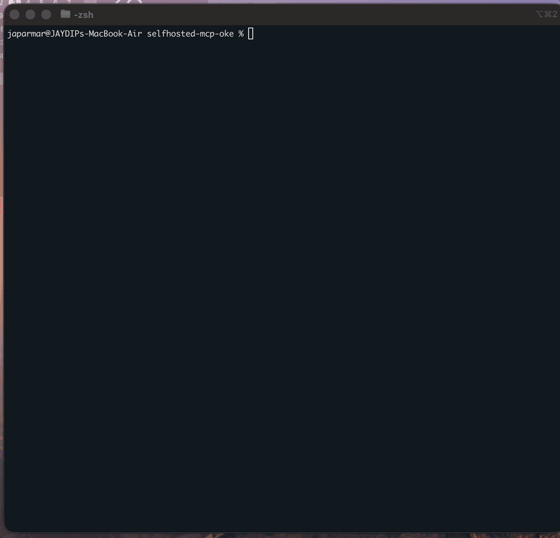
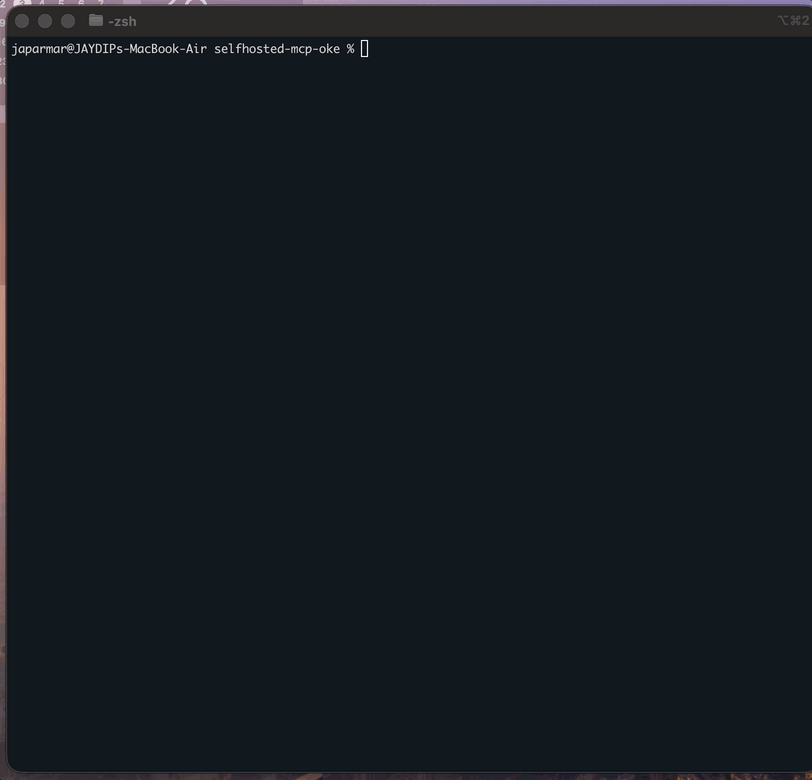
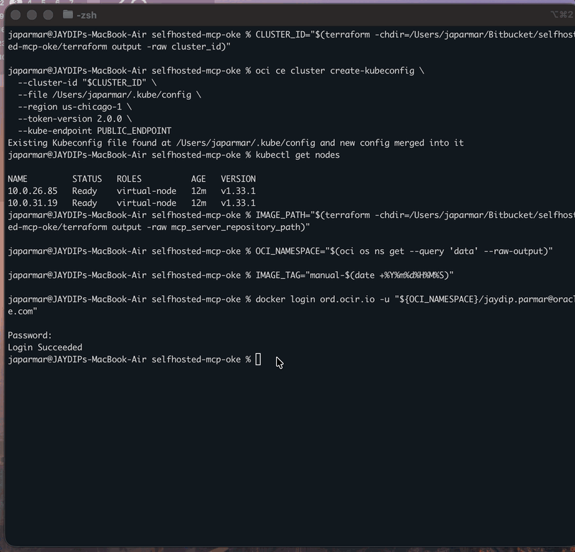
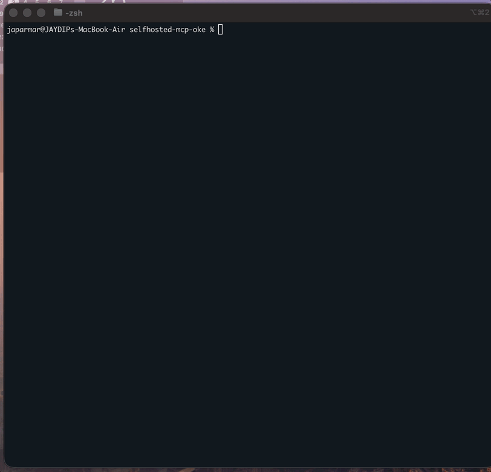
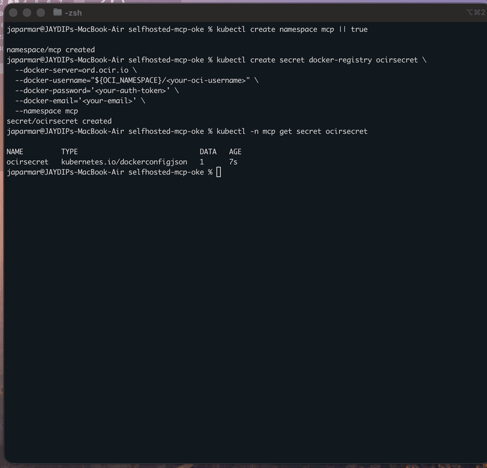
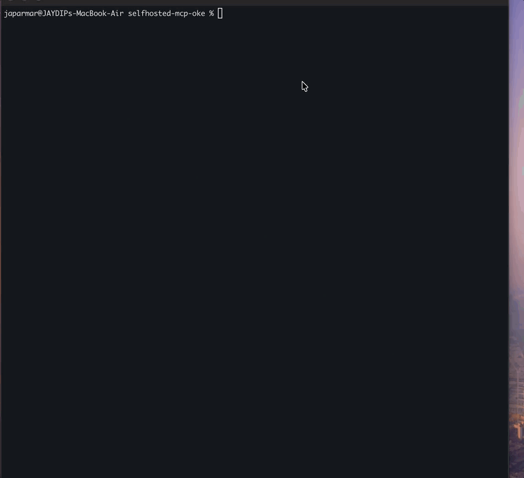
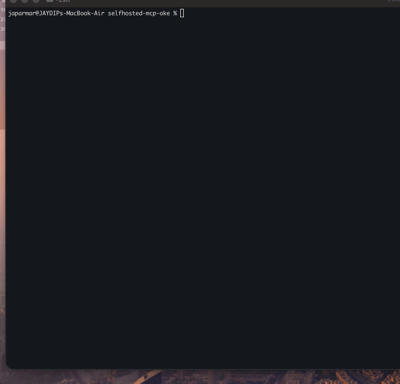
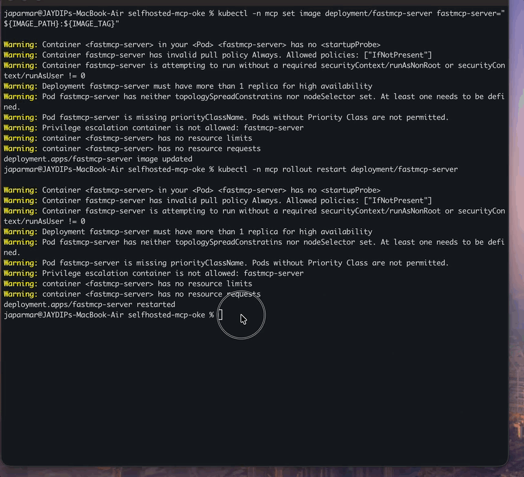
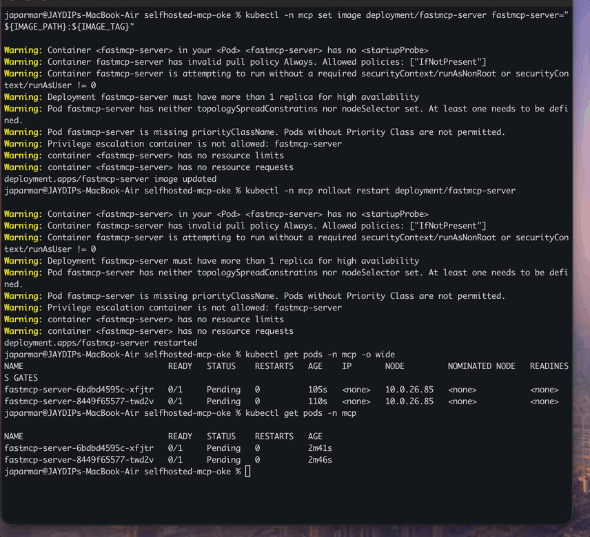

# Deploying MCP Audio + Client on OCI Kubernetes Engine (OKE)

## Overview

This is the **manual path** for deploying MCP audio + client on OCI OKE.

If you are new and want the easiest path, use the Makefile flow from `README.md`.

If you want to do it yourself step by step, follow this guide.

Goal:

- create infra with Terraform
- push server and client images to OCIR
- create secrets
- replace manifest values
- deploy to Kubernetes
- verify everything is working

---

## Architecture

The deployment consists of:

- **Terraform-managed OCI resources** (VCN, OKE, OCIR repo, bucket, etc.)
- **MCP audio server and MCP client container images** hosted in **OCIR** (`<region-key>.ocir.io/...`)
- **Kubernetes Deployment**: `fastmcp-server`
- **Kubernetes Deployment**: `fastmcp-client`
- **Kubernetes Service (LoadBalancer)**: `fastmcp-server`, `fastmcp-client`
- **Kubernetes Secrets**:
  - `mcp-secrets` (runtime env)
  - `mcp-client-secrets` (client runtime env)
  - `ocirsecret` (OCIR image pull authentication)

Flow:
1. Provision/refresh infra with Terraform
2. Build and push MCP audio + client images to OCIR
3. Create namespace + secrets
4. Replace manifest placeholders and validate replacement
5. Deploy manifest and roll out images
6. Validate `/health`, MCP URL, and client UI

---

## Before you start

You only need to remember this simple order:

1. Copy `terraform.tfvars.example`
2. Fill real values
3. Run Terraform
4. Build and push images
5. Create secrets
6. Replace placeholders in manifest
7. Deploy
8. Verify

---

## Step 1: Create your tfvars file

Start by creating your tfvars file from the example:

```bash
cp terraform/terraform.tfvars.example terraform/terraform.tfvars
```

Now open `terraform/terraform.tfvars` and replace the placeholders:

```hcl
tenancy_ocid       = "<TENANCY_OCID>"
compartment_id     = "<COMPARTMENT_OCID>"
region             = "<OCI_REGION>"
resource_name_prefix                 = "mcp"
mcp_container_repository_name        = "audio-repo"
mcp_client_container_repository_name = "client-repo"
speech_bucket_name                   = "audio-bucket"
```

By default, Terraform generates stable names using `resource_name_prefix`, a base name, and the last 5 characters of the compartment OCID, for example `mcp-audio-repo-hronz`.

Those naming values are already present in `terraform.tfvars.example`, so when you copy it they are included automatically. If you want custom base names instead, edit them in `terraform.tfvars` like this:

```hcl
resource_name_prefix                 = "mcp"
mcp_container_repository_name        = "team-audio-repo"
mcp_client_container_repository_name = "team-client-repo"
speech_bucket_name                   = "team-audio-bucket"
```

If you keep the defaults, Terraform uses `audio-repo`, `client-repo`, and `audio-bucket` as the base names, then exposes the final repository and bucket names as outputs.

That’s it. Save the file and move on.

---

## Step 2: Quick pre-check

Run pre-checks:

```bash
terraform -chdir=terraform version
oci --version
kubectl version --client
docker --version
python3 --version
```

Also run this simple OCI login check:

```bash
oci os ns get
```

Make sure:

- Terraform works
- OCI CLI is logged in
- Docker is running

What does **"OCI CLI is logged in"** mean?

It means the `oci` command can talk to your Oracle Cloud account.

Easy check:

- run `oci os ns get`
- if it returns your namespace, OCI CLI is working
- if it fails, you need to configure/login OCI CLI first

What does it return?

- it returns your ** namespace**
- you can use that same value as `OCI_NAMESPACE`
- you also use it in OCIR login, for example:


If you are already logged in, `oci os ns get` is enough.

If you need to set up  again, run:

```bash
oci setup config
```


## Step 3: Create your env files

```bash
cp mcp-audio/.env.example mcp-audio/.env
cp mcp-client/.env.example mcp-client/.env
```

If needed, update the values inside those files.

For local `mcp-client/.env`, make sure these are set if you want the Audio Bucket dropdown and upload flow to work reliably:

- `ENVIRONMENT=dev`
- `AUTH_PROFILE=DEFAULT` (or your working OCI profile)
- `OCI_REGION=<your-bucket-region>`
- `COMPARTMENT_ID=<compartment-ocid>`
- `OCI_NAMESPACE=<object-storage-namespace>`
- `SPEECH_BUCKET=<bucket-name>`
- `MODEL_ID`, `SERVICE_ENDPOINT`, `PROVIDER`

Important:

- in local dev mode, `OCI_REGION` overrides the region from your OCI profile for bucket discovery
- if `OCI_REGION` is unset, the client uses the region from the selected OCI profile
- the client bucket dropdown uses local OCI auth, so a working profile is still required

Good quick checks:

```bash
test -f mcp-audio/.env && echo "mcp-audio/.env ready"
test -f mcp-client/.env && echo "mcp-client/.env ready"
```

---

## Friendly note about Makefile override behavior

If you use the guided Makefile option instead of this manual blog flow:

- the Makefile can rewrite `terraform/terraform.tfvars` through the `update-tfvars` target
- values at the top of `Makefile` can override what gets written into `terraform/terraform.tfvars`
- `deploy-fresh-guided` now reuses `compartment_id` and `region` from `terraform/terraform.tfvars` when available, and prompts only if missing
- Terraform init in guided flow includes retry handling for transient registry connectivity issues

In Makefile, variables are split into 2 parts:

- **Required (mandatory):** `TENANCY_OCID`, `COMPARTMENT_OCID`, `REGION`
- **Optional:** `DOCKER_USER`, `DOCKER_PASS`, `DOCKER_EMAIL`, `IMAGE_VERSION`, `CLIENT_IMAGE_VERSION`, `RESOURCE_NAME_PREFIX`, `MCP_CONTAINER_REPOSITORY_NAME`, `MCP_CLIENT_CONTAINER_REPOSITORY_NAME`, `SPEECH_BUCKET_NAME`, `KUBECONFIG_PATH`

If you want Makefile-side override behavior, update the variables near the top of `Makefile`, such as:

- `TENANCY_OCID`
- `COMPARTMENT_OCID`
- `REGION`


- for this manual guide, edit `terraform/terraform.tfvars` directly
- if you want Makefile-side override behavior, update the values at the top of `Makefile`


---

## Step 4: Run Terraform

```bash
terraform -chdir=terraform init
terraform -chdir=terraform apply -var-file=terraform.tfvars -auto-approve
```

Notes:

- Container repository names are generated deterministically by default, which avoids tenancy-wide OCIR name collisions.
- If you explicitly set a repository name and that name already exists elsewhere in tenancy, Terraform will reuse it instead of trying to recreate it.
- The speech bucket name is also resolved by Terraform, and the bucket itself is created by Terraform during `terraform apply`.
- Ensure your OCIR user/token has push permission on the actual target repository.

After it finishes, check the outputs:

```bash
terraform -chdir=terraform output
terraform -chdir=terraform output -raw cluster_id
terraform -chdir=terraform output -raw mcp_server_repository_path
terraform -chdir=terraform output -raw mcp_client_repository_path
terraform -chdir=terraform output -raw oci_namespace
terraform -chdir=terraform output -raw speech_bucket_name
```



---

## Step 5: Configure kubeconfig

```bash
CLUSTER_ID="$(terraform -chdir=terraform output -raw cluster_id)"
OCI_REGION="$(terraform -chdir=terraform output -raw oci_region 2>/dev/null || awk -F'=' '/^[[:space:]]*region[[:space:]]*=/{gsub(/["[:space:]]/,"",$2); print $2; exit}' terraform/terraform.tfvars)"
oci ce cluster create-kubeconfig \
  --cluster-id "$CLUSTER_ID" \
  --file "/Users/japarmar/.kube/config" \
  --region "$OCI_REGION" \
  --token-version 2.0.0 \
  --kube-endpoint PUBLIC_ENDPOINT
```

Verify:

```bash
kubectl get nodes
```



---

## Step 6: Build and push both images

```bash
SERVER_IMAGE_PATH="$(terraform -chdir=terraform output -raw mcp_server_repository_path)"
CLIENT_IMAGE_PATH="$(terraform -chdir=terraform output -raw mcp_client_repository_path)"
OCI_NAMESPACE="$(oci os ns get --query 'data' --raw-output)"
REGISTRY_HOST="$(printf '%s\n' "$SERVER_IMAGE_PATH" | awk -F/ '{print $1}')"
IMAGE_TAG="latest"

docker login "${REGISTRY_HOST}" -u "${OCI_NAMESPACE}/<oci-username>"
docker buildx build --platform linux/amd64 -t "${SERVER_IMAGE_PATH}:${IMAGE_TAG}" ./mcp-audio --push
docker buildx build --platform linux/amd64 -t "${CLIENT_IMAGE_PATH}:${IMAGE_TAG}" ./mcp-client --push
```

The OCIR login host comes from the image path. For example:

- `ap-osaka-1` uses region key `KIX`, so the OCIR host is `kix.ocir.io`
- `us-chicago-1` uses region key `ORD`, so the OCIR host is `ord.ocir.io`

Always log in to the same OCIR host shown at the start of your Terraform image path.

Verify push ends with digest line and image has `linux/amd64`:

```bash
docker manifest inspect "${SERVER_IMAGE_PATH}:${IMAGE_TAG}" | jq -r '.manifests[]?.platform | "os=\(.os) arch=\(.architecture)"'
docker manifest inspect "${CLIENT_IMAGE_PATH}:${IMAGE_TAG}" | jq -r '.manifests[]?.platform | "os=\(.os) arch=\(.architecture)"'
```



---

## Step 7: Create namespace and image pull secret

```bash
kubectl create namespace mcp || true

kubectl -n mcp delete secret ocirsecret --ignore-not-found
kubectl create secret docker-registry ocirsecret \
  --docker-server="${REGISTRY_HOST}" \
  --docker-username="${OCI_NAMESPACE}/<your-oci-username>" \
  --docker-password='<your-auth-token>' \
  --docker-email='<your-email>' \
  --namespace mcp
```

Verify:

```bash
kubectl -n mcp get secret ocirsecret
docker login "${REGISTRY_HOST}" -u "${OCI_NAMESPACE}/<your-oci-username>"
docker pull "${SERVER_IMAGE_PATH}:${IMAGE_TAG}"
docker pull "${CLIENT_IMAGE_PATH}:${IMAGE_TAG}"
```



---

## Step 8: Create runtime secrets

Required keys in `mcp-audio/.env`:
- `ENVIRONMENT=PRD`
- `OCI_REGION=<your-deployment-region>`
- `COMPARTMENT_ID=<ocid1.compartment...>`
- `OCI_NAMESPACE=<namespace>`
- `SPEECH_BUCKET=<bucket-name>`

Recommended keys in `mcp-client/.env`:
- `ENVIRONMENT=PRD`
- `COMPARTMENT_ID=<ocid1.compartment...>`
- `MODEL_ID=<model-id>`
- `SERVICE_ENDPOINT=<genai-endpoint>`
- `PROVIDER=<provider-name>`
- `OCI_NAMESPACE=<namespace>`
- `SPEECH_BUCKET=<bucket-name>`

Create secret:

```bash
kubectl -n mcp delete secret mcp-secrets --ignore-not-found
kubectl create secret generic mcp-secrets \
  --from-env-file=mcp-audio/.env \
  -n mcp

kubectl -n mcp delete secret mcp-client-secrets --ignore-not-found
kubectl create secret generic mcp-client-secrets \
  --from-env-file=mcp-client/.env \
  -n mcp
```

Verify:

```bash
kubectl -n mcp get secret mcp-secrets
kubectl -n mcp get secret mcp-client-secrets
```



---

## Step 9: Replace placeholders in the manifest

If your manifest still contains placeholders, run replacements first:

```bash
MANIFEST="mcp-audio/k8s/manifest.yaml"

export SERVER_IMAGE_PATH="$(terraform -chdir=terraform output -raw mcp_server_repository_path)"
export CLIENT_IMAGE_PATH="$(terraform -chdir=terraform output -raw mcp_client_repository_path)"
export OCI_NAMESPACE="$(terraform -chdir=terraform output -raw oci_namespace)"
export SPEECH_BUCKET="$(terraform -chdir=terraform output -raw speech_bucket_name)"
export COMPARTMENT_OCID="$(awk -F'=' '/^[[:space:]]*compartment_id[[:space:]]*=/{gsub(/["[:space:]]/,"",$2); print $2; exit}' terraform/terraform.tfvars)"
export IMAGE_TAG="latest"
export MANIFEST="mcp-audio/k8s/manifest.yaml"

echo "$SERVER_IMAGE_PATH"
echo "$CLIENT_IMAGE_PATH"
echo "$OCI_NAMESPACE"
echo "$SPEECH_BUCKET"
echo "$COMPARTMENT_OCID"
echo "$IMAGE_TAG"
echo "$MANIFEST"

grep -nE '<mcp-audio-image-tag>|<mcp-server-image-tag>|<mcp-client-image-tag>|<Compartment_OCID>|<OCI_NAMESPACE>|<SPEECH_BUCKET>|<Notification_Topic_OCID>' "$MANIFEST" || true

sed -i '' -e "s|<mcp-audio-image-tag>|$SERVER_IMAGE_PATH:$IMAGE_TAG|g" "$MANIFEST"
sed -i '' -e "s|<mcp-server-image-tag>|$SERVER_IMAGE_PATH:$IMAGE_TAG|g" "$MANIFEST"
sed -i '' -e "s|<mcp-client-image-tag>|$CLIENT_IMAGE_PATH:$IMAGE_TAG|g" "$MANIFEST"
sed -i '' -e "s|<Compartment_OCID>|$COMPARTMENT_OCID|g" "$MANIFEST"
sed -i '' -e "s|<OCI_NAMESPACE>|$OCI_NAMESPACE|g" "$MANIFEST"
sed -i '' -e "s|<SPEECH_BUCKET>|$SPEECH_BUCKET|g" "$MANIFEST"
sed -i '' -e "s|<Notification_Topic_OCID>||g" "$MANIFEST"
if grep -qE '<mcp-audio-image-tag>|<mcp-server-image-tag>|<mcp-client-image-tag>|<Compartment_OCID>|<OCI_NAMESPACE>|<SPEECH_BUCKET>|<Notification_Topic_OCID>' "$MANIFEST"; then
  echo "ERROR: unreplaced placeholders still exist in $MANIFEST"
  grep -nE '<mcp-audio-image-tag>|<mcp-server-image-tag>|<mcp-client-image-tag>|<Compartment_OCID>|<OCI_NAMESPACE>|<SPEECH_BUCKET>|<Notification_Topic_OCID>' "$MANIFEST"
  exit 1
fi

grep -n 'image:' "$MANIFEST"
```

Very important:

If the placeholder check still shows any `<...>` values, stop here and fix them first.

---

## Step 10: Deploy to Kubernetes

Now deploy:

```bash
export SERVER_IMAGE_PATH="$(terraform -chdir=terraform output -raw mcp_server_repository_path)"
export CLIENT_IMAGE_PATH="$(terraform -chdir=terraform output -raw mcp_client_repository_path)"
export IMAGE_TAG="latest"

kubectl apply -f mcp-audio/k8s/manifest.yaml
kubectl -n mcp set image deployment/fastmcp-server fastmcp-server="${SERVER_IMAGE_PATH}:${IMAGE_TAG}"
kubectl -n mcp set image deployment/fastmcp-client fastmcp-client="${CLIENT_IMAGE_PATH}:${IMAGE_TAG}"
kubectl -n mcp rollout restart deployment/fastmcp-server
kubectl -n mcp rollout status deployment/fastmcp-server --timeout=300s
kubectl -n mcp rollout restart deployment/fastmcp-client
kubectl -n mcp rollout status deployment/fastmcp-client --timeout=300s
```





---

## Step 11: Validate deployment

Check pods and images:

```bash
kubectl -n mcp get pods -o wide
kubectl -n mcp get deploy fastmcp-server -o jsonpath='{.spec.template.spec.containers[0].image}{"\n"}'
kubectl -n mcp get deploy fastmcp-client -o jsonpath='{.spec.template.spec.containers[0].image}{"\n"}'
```

Then check the service and health endpoint:

```bash
SERVER_IP="$(kubectl get svc fastmcp-server -n mcp -o jsonpath='{.status.loadBalancer.ingress[0].ip}')"
CLIENT_IP="$(kubectl get svc fastmcp-client -n mcp -o jsonpath='{.status.loadBalancer.ingress[0].ip}')"
echo "$SERVER_IP"
echo "$CLIENT_IP"
curl -i "http://${SERVER_IP}/health"
```

Expected URLs:

```text
MCP URL   = http://<SERVER_IP>/mcp/
Client UI = http://<CLIENT_IP>/
```

If you see the health response and the LoadBalancer IPs, you are in good shape 🎉

### Optional last step: cleanup

If you want to clean up old deployment/state, run this at the end.

Fast Makefile cleanup options:

```bash
# Full cleanup (K8s + Terraform + bucket cleanup)
make destroy-all-fresh

# Only Kubernetes cleanup
make destroy-k8s
```

Clean Kubernetes resources:

```bash
kubectl delete -f mcp-audio/k8s/manifest.yaml --ignore-not-found
kubectl -n mcp delete secret mcp-secrets mcp-client-secrets ocirsecret --ignore-not-found
kubectl delete ns mcp --ignore-not-found
```

Optional Terraform destroy:

```bash
NS="$(oci os ns get --query 'data' --raw-output)"
BUCKET="$(terraform -chdir=terraform output -raw speech_bucket_name)"
OCI_REGION="$(terraform -chdir=terraform output -raw oci_region 2>/dev/null || awk -F'=' '/^[[:space:]]*region[[:space:]]*=/{gsub(/["[:space:]]/,"",$2); print $2; exit}' terraform/terraform.tfvars)"
oci os object bulk-delete -ns "$NS" -bn "$BUCKET" --force --region "$OCI_REGION" || true
oci os object bulk-delete -ns "$NS" -bn "$BUCKET" --force --region "$OCI_REGION" || true

terraform -chdir=terraform init
terraform -chdir=terraform destroy -var-file=terraform.tfvars -auto-approve
```



---

## If something goes wrong

Quick checks:

```bash
kubectl get events -n mcp --sort-by=.lastTimestamp | tail -n 40
kubectl -n mcp describe pod <pod-name>
kubectl -n mcp logs deploy/fastmcp-server --tail=300
```

High-signal checks:

```bash
kubectl -n mcp get secret ocirsecret
kubectl -n mcp get secret mcp-secrets
kubectl -n mcp get secret mcp-client-secrets
kubectl -n mcp get deploy fastmcp-server -o jsonpath='{.spec.template.spec.containers[0].image}{"\n"}'
kubectl -n mcp get deploy fastmcp-client -o jsonpath='{.spec.template.spec.containers[0].image}{"\n"}'
```

### If placeholders are not replaced

The manifest and Makefile may not always use the same placeholder label for the server image (`<mcp-audio-image-tag>` vs `<mcp-server-image-tag>`).

Before deployment, always run:

```bash
grep -nE '<mcp-audio-image-tag>|<mcp-server-image-tag>|<mcp-client-image-tag>|<Compartment_OCID>|<OCI_NAMESPACE>|<SPEECH_BUCKET>' mcp-audio/k8s/manifest.yaml
```

If placeholders are shown, run replacement first (Step 9):

```bash
MANIFEST="mcp-audio/k8s/manifest.yaml"
SERVER_IMAGE_PATH="$(terraform -chdir=terraform output -raw mcp_server_repository_path)"
CLIENT_IMAGE_PATH="$(terraform -chdir=terraform output -raw mcp_client_repository_path)"
OCI_NAMESPACE="$(terraform -chdir=terraform output -raw oci_namespace)"
SPEECH_BUCKET="$(terraform -chdir=terraform output -raw speech_bucket_name)"
COMPARTMENT_OCID="$(awk -F'=' '/^[[:space:]]*compartment_id[[:space:]]*=/{gsub(/["[:space:]]/,"",$2); print $2; exit}' terraform/terraform.tfvars)"
IMAGE_TAG="latest"

sed -i '' -e "s|<mcp-audio-image-tag>|$SERVER_IMAGE_PATH:$IMAGE_TAG|g" "$MANIFEST"
sed -i '' -e "s|<mcp-server-image-tag>|$SERVER_IMAGE_PATH:$IMAGE_TAG|g" "$MANIFEST"
sed -i '' -e "s|<mcp-client-image-tag>|$CLIENT_IMAGE_PATH:$IMAGE_TAG|g" "$MANIFEST"
sed -i '' -e "s|<Compartment_OCID>|$COMPARTMENT_OCID|g" "$MANIFEST"
sed -i '' -e "s|<OCI_NAMESPACE>|$OCI_NAMESPACE|g" "$MANIFEST"
sed -i '' -e "s|<SPEECH_BUCKET>|$SPEECH_BUCKET|g" "$MANIFEST"
sed -i '' -e "s|<Notification_Topic_OCID>||g" "$MANIFEST"
```

If any placeholder still appears, do not deploy.

### If image pull fails

Avoid creating `ocirsecret` from Docker config when `credsStore` is used (e.g., `osxkeychain`).
Create the secret explicitly:

```bash
kubectl -n mcp delete secret ocirsecret --ignore-not-found
kubectl create secret docker-registry ocirsecret \
  --docker-server="$REGISTRY_HOST" \
  --docker-username='<namespace>/<oci-username>' \
  --docker-password='<oci-auth-token>' \
  --docker-email='<your-email>' \
  --namespace mcp
```

Validate secret payload:

```bash
kubectl -n mcp get secret ocirsecret -o jsonpath='{.data.\.dockerconfigjson}' | base64 --decode
```

Repush and restart if needed:

```bash
docker push "${SERVER_IMAGE_PATH}:latest"
docker push "${CLIENT_IMAGE_PATH}:latest"
kubectl -n mcp rollout restart deployment/fastmcp-server
kubectl -n mcp rollout status deployment/fastmcp-server --timeout=300s
kubectl -n mcp rollout restart deployment/fastmcp-client
kubectl -n mcp rollout status deployment/fastmcp-client --timeout=300s
```

### If you are on Apple Silicon / ARM

If image is built on Apple Silicon without platform override, `latest` may be pushed as `linux/arm64` and OKE `amd64` nodes cannot run it.

Always build for amd64:

```bash
docker buildx build --platform linux/amd64 -t "${SERVER_IMAGE_PATH}:latest" ./mcp-audio --push
docker buildx build --platform linux/amd64 -t "${CLIENT_IMAGE_PATH}:latest" ./mcp-client --push
docker manifest inspect "${SERVER_IMAGE_PATH}:latest" | jq -r '.manifests[]?.platform | "os=\(.os) arch=\(.architecture)"'
docker manifest inspect "${CLIENT_IMAGE_PATH}:latest" | jq -r '.manifests[]?.platform | "os=\(.os) arch=\(.architecture)"'
```

Expected output must include `os=linux arch=amd64`.

### Fast reset if Terraform is already fine

Use this when Terraform is healthy and only K8s app layer needs reset.

```bash
# 1) Cleanup K8s app resources
kubectl delete -f mcp-audio/k8s/manifest.yaml --ignore-not-found
kubectl delete pod -n mcp --all --ignore-not-found
kubectl -n mcp delete secret ocirsecret mcp-secrets mcp-client-secrets --ignore-not-found
kubectl delete ns mcp --ignore-not-found

# 2) Recreate namespace and secrets
kubectl create namespace mcp
kubectl create secret generic mcp-secrets \
  --from-env-file=mcp-audio/.env \
  -n mcp
kubectl create secret generic mcp-client-secrets \
  --from-env-file=mcp-client/.env \
  -n mcp

OCI_NAMESPACE="$(oci os ns get --query 'data' --raw-output)"
SERVER_IMAGE_PATH="$(terraform -chdir=terraform output -raw mcp_server_repository_path)"
REGISTRY_HOST="$(printf '%s\n' "$SERVER_IMAGE_PATH" | awk -F/ '{print $1}')"
kubectl create secret docker-registry ocirsecret \
  --docker-server="$REGISTRY_HOST" \
  --docker-username="${OCI_NAMESPACE}/<your-exact-oci-username-from-console>" \
  --docker-password='<NEW_OCIR_AUTH_TOKEN>' \
  --docker-email='<your-email>' \
  --namespace mcp

# 3) Push latest image and redeploy
CLIENT_IMAGE_PATH="$(terraform -chdir=terraform output -raw mcp_client_repository_path)"
docker login "$REGISTRY_HOST" -u "${OCI_NAMESPACE}/<your-exact-oci-username-from-console>"
docker build --platform linux/amd64 -t "${SERVER_IMAGE_PATH}:latest" mcp-audio
docker build --platform linux/amd64 -t "${CLIENT_IMAGE_PATH}:latest" mcp-client
docker push "${SERVER_IMAGE_PATH}:latest"
docker push "${CLIENT_IMAGE_PATH}:latest"

kubectl apply -f mcp-audio/k8s/manifest.yaml
kubectl -n mcp set image deployment/fastmcp-server fastmcp-server="${SERVER_IMAGE_PATH}:latest"
kubectl -n mcp set image deployment/fastmcp-client fastmcp-client="${CLIENT_IMAGE_PATH}:latest"
kubectl -n mcp rollout restart deployment/fastmcp-server
kubectl -n mcp rollout status deployment/fastmcp-server --timeout=300s
kubectl -n mcp rollout restart deployment/fastmcp-client
kubectl -n mcp rollout status deployment/fastmcp-client --timeout=300s
kubectl -n mcp get pods -o wide
```

Use this path for:
- `MandatorySecretNotFound`
- `FailedToRetrieveImagePullSecret`
- `ContainerCreateFailed` due to image auth/pull

---

## Done

You now have a cleaner manual guide:

- start from `terraform.tfvars.example`
- fill values
- deploy step by step
- check placeholders
- validate at the end

If you want less typing next time, use the Makefile option from `README.md`.
